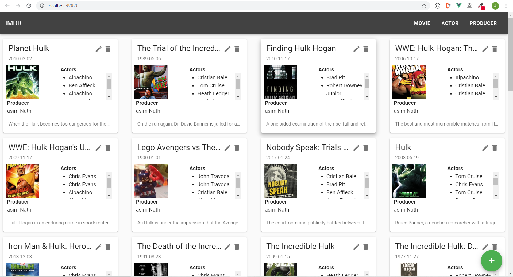
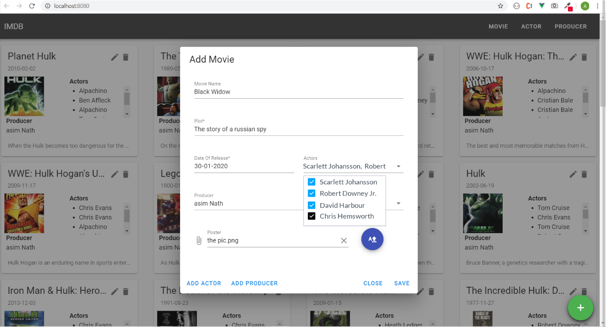
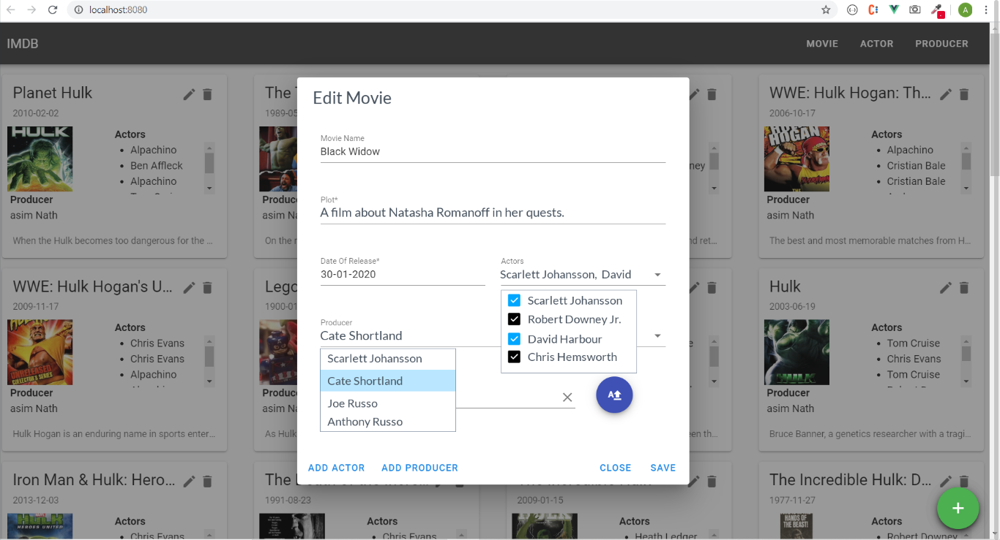
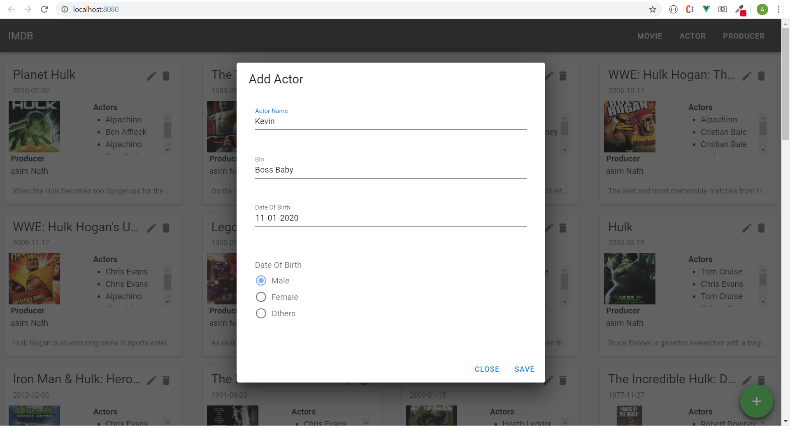
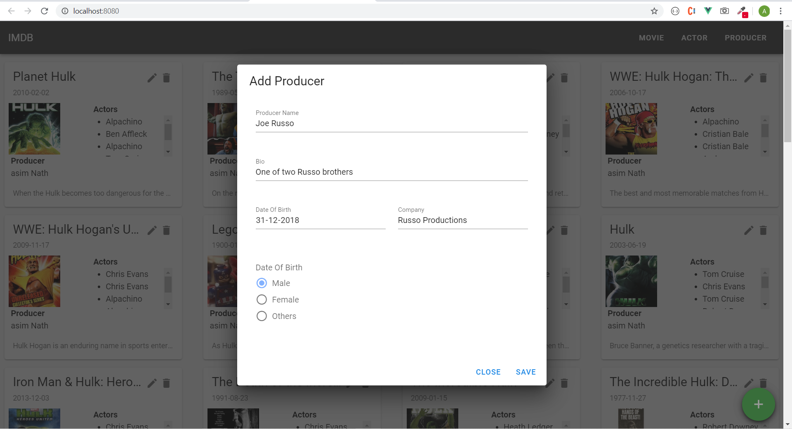

# imdb

Movie application like IMDB, with REST APIs and Relational Db

### Application Scope

<ol>
    <li> Movies Listing </li>
     
    <li> Add Movie </li>
     
    <li> Edit Movie </li>
     
    <li> Add Actor </li>
     
    <li> Add Producer </li>
</ol>